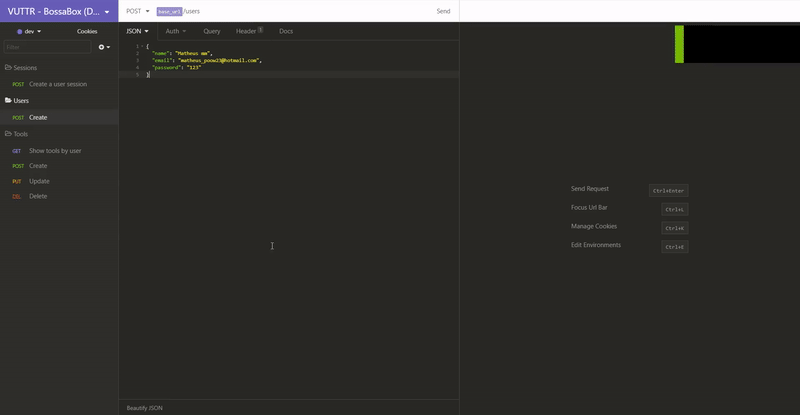

<p align="center">

  

</p>

<h2 align="center">Backend da aplicação VUTTR</h2>

<div align="center">

[Introdução](#-Introdução)
| [Tecnologias usadas](#-Tecnologias-usadas)
| [Como utilizar localmente](#-Como-utilizar-localmente)
| [Status do projeto](#-Status-do-projeto)

Projeto construído com conhecimentos em Node.js, Typescript e alguns patterns como SOLID, DDD e TDD.

</div>

---

# 👨🏻‍💻 Introdução

## Objetivo

Aplicar meus conhecimentos em uma aplicação de forma mais profissional.

## Esse repositório possui

Construção de uma API para a aplicação **VUTTR** (Very Useful Tools to Remember), em que cada usuário poderá cadastrar ferramentas que ele acha interessante com seus respectivos nomes, links, descrições e tags.

## Projeto

Essa aplicação server para avaliação técnica dos meus conhecimentos em um desafio idealizado pela [BossaBox](https://bossabox.com/).

A documentação de referência da API no formato Swagger poderá ser encontrada através desse [link](https://app.swaggerhub.com/apis-docs/Manfrinmm/VUTTR-API/1.0)

<div align="center" >
  

[](https://insomnia.rest/run/?label=VUTTR-backend&uri=https%3A%2F%2Fgithub.com%2FManfrinmm%2FVUTTR-backend%2Fblob%2Fmaster%2Fdocs%2Fdocumentation%2FInsomnia.json)

Para utilizar documentação de referência no insomnia basta clicar no batão acima

</div>

# 🚀 Tecnologias usadas

- [NodeJs](https://nodejs.org)
- [Typescript](https://www.typescriptlang.org)
- [Express](https://expressjs.com)
- [Celebrate](https://github.com/arb/celebrate#readme)
- [Typeorm](https://typeorm.io/#/)
- [PostgreSQL](https://www.postgresql.org/)
- [Jest](https://jestjs.io/)
- [Eslint](https://eslint.org/)
- [Husky](https://www.npmjs.com/package/husky)
- [Commitizen](https://www.npmjs.com/package/commitizen)
- [JsonWebToken](https://www.npmjs.com/package/jsonwebtoken)
- [Docker](https://www.docker.com/)

# 📋 Requisitos mínimos para rodar o projeto localmente

- NodeJs instalado na versão 12.x
- Docker e Docker compose (opcional)
- Gerenciador de pacotes do Node, [Npm](https://www.npmjs.com/) ou [Yarn](https://yarnpkg.com/).
- Ter uma instância do PostgreSQL para que o typeorm possa se conectar

# Como utilizar localmente

- Clone o repositório:

  ```bash
  git clone https://github.com/Manfrinmm/vutte-backend
  ```

- Abra o terminal na pasta do projeto

- Instale as dependências:

  Via yarn

  ```bash
    yarn
  ```

  ou via npm

  ```bash
    npm install
  ```

- Renomeie o arquivo `.env.example` para `.env` e edite suas variáveis ambientes

- Iniciando o servidor:

  - Via docker

    ```bash
      docker-compose up -d
    ```

    Nesse método uma instância do PostgreSQL e do servidor já é criado.

    A porta do servidor será aquela utilizada no arquivo `.env`

  - Via terminal:

    Via yarn

    ```bash
      yarn dev
    ```

    ou via npm

    ```bash
      npm run dev
    ```

    Esse método é necessário ter uma instância do PostgreSQL já configurada e com credenciais inseridas dentro do arquivo `.env`

- Rodando as migrations:

  Via yarn

  ```bash
    yarn typeorm migration:run
  ```

  ou via npm

  ```bash
    npm run typeorm migration:run
  ```

- A partir daqui sua API já deve estar funcionando (☞ ﾟヮﾟ)☞

- Para rodar os testes:

  Via yarn

  ```bash
    yarn test
  ```

  ou via npm

  ```bash
    npm run test
  ```

# 🛠 Status do projeto

## Versão 1.0

- Criação de usuário
- Autenticação de usuário com JWT
- **CRUD** (Create/Read/Update/Delete) de tools

---

Made by Matheus Menezes Manfrin 🦥 [See my LinkedIn](https://www.linkedin.com/in/matheusmmm/)
